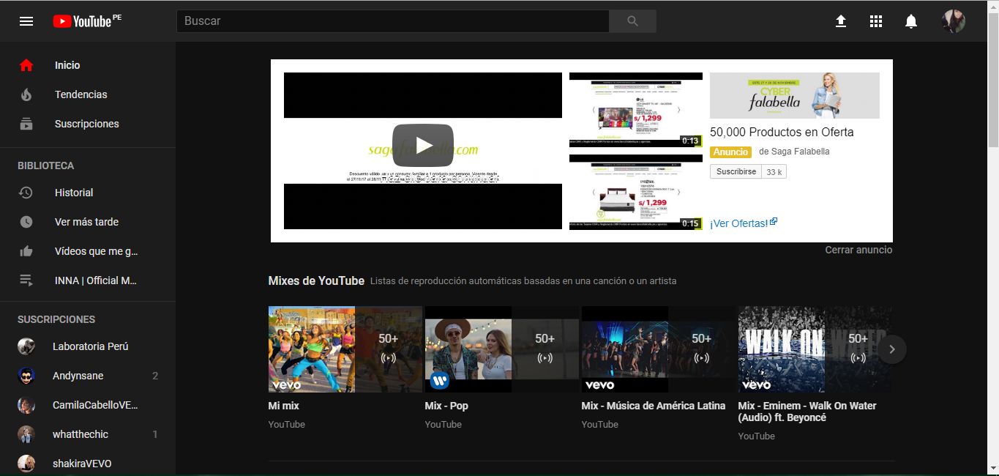
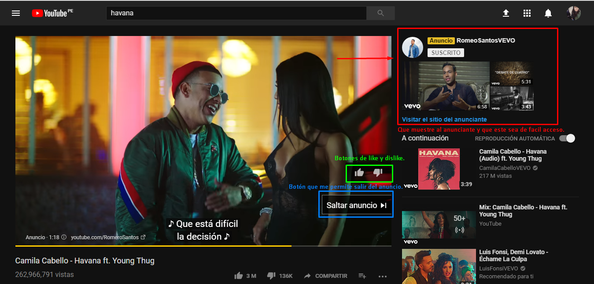
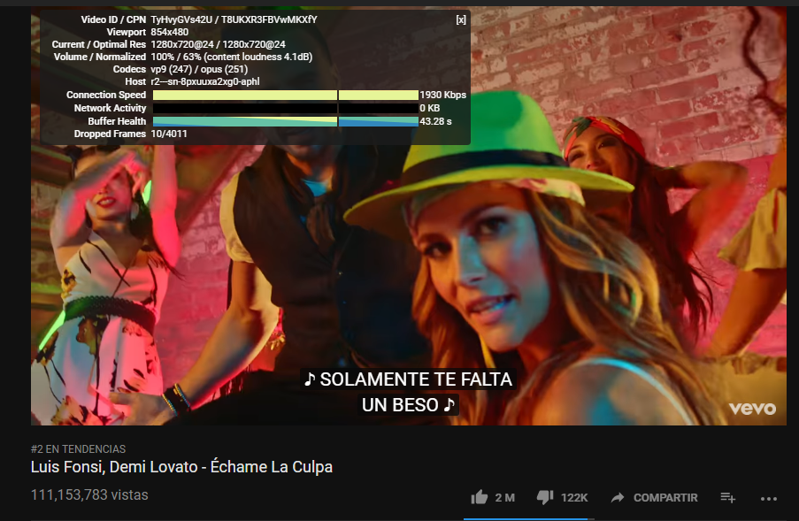

## ** YOUTUBE ** ##
Explica de forma detallada las partes que conforman el UX (Experiencia de usuario) y UI (Interfaz de usuario) del sitio web **YOUTUBE**.  

  

| UX            | UI            |
|:-------------:|:-------------:|
| Que al realizar la búsqueda de algún video, me muestre sugerencias de posibles títulos del video a buscar.   | Que me permite realizar un cambio de color de tema, para mejorar mi experiencia.|
| Que me notifique los nuevos videos subidos, a los canales que me encuentre suscrita.   | Colores corporativos: blanco, negro y rojo.|
| Que sea de fácil acceso ver la lista de "tendencias" como parte de mi opción de menú.      | Cambio de modos de tamaño del video cine y pantalla completa. |
| Que la exploración me muestre por secciones, ya sea de mis canales favoritos o propuestas por la misma web. | Barra de reproducción que se muestre y oculte.  |
| Que me permita agregar videos favoritos a una lista de reproduccion, y verlos más tarde. | Diseño y ubicacion de menús. |
| Que me sugiera videos recomendados en base a mi "historial",  | Diseño de los botones. |
| Que me permita subir de manera sencilla mis videos a la página. | Diseño de las cajas de comentarios.|
| Que me permita crear mis propias listas de reproducción. |  La barra de progreso de la carga de búsqueda de un video. |
| Reproduccion automática. | El cuadro de busqueda visible y siempre estatico.     |
| Que me permita ver diferentes categorias de manera aleatoria. | La barra de progreso de la visualización de los videos.  |
| Que me permita configurar el la velocidad, resolución, y subtitulos del video.| |
| Cambio de la calidad del video según la velocidad de la conexión. |  Diseño de los iconos.  |
| Te permite saber dónde te quedaste la última vez que viste un vídeo. |  |
| Recomendarte videos segun tu historial. |  |
| Subtitulos con tracuccion automática al idioma según desee. | |
| Filtrar comentarios. | |

 

 